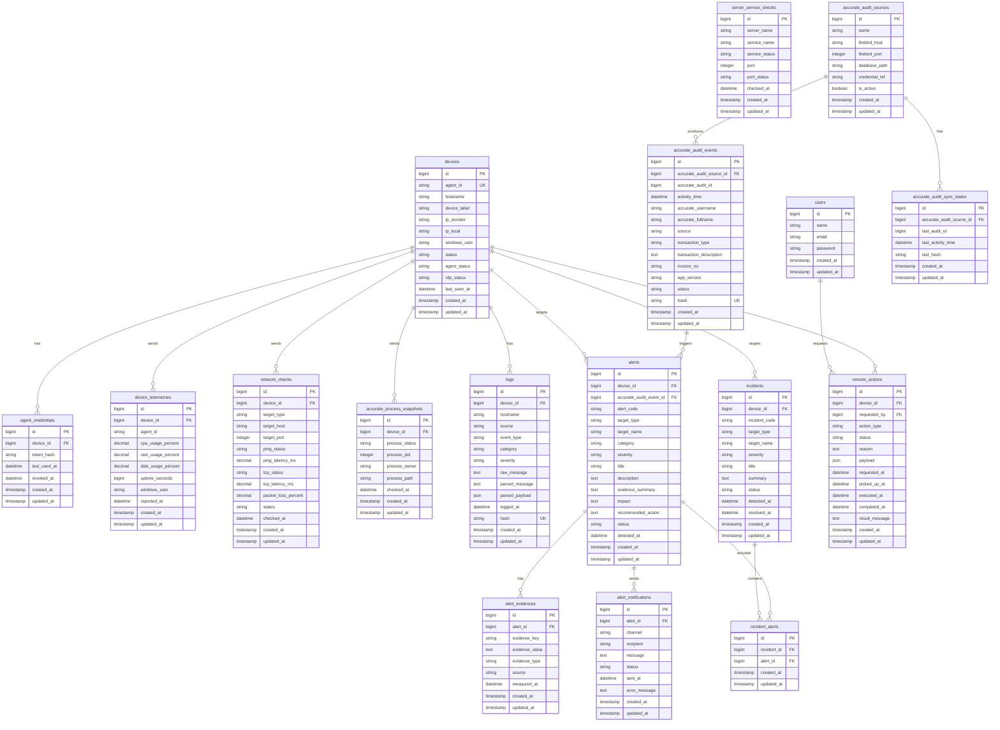

# 04 — Database Design v2
# Centralized Log Monitoring Dashboard

**Versi:** 2.0  
**Status:** Draft Final untuk implementasi awal dengan Codex / AI Agent  
**Nama Sistem:** Centralized Log Monitoring Dashboard  
**Jenis Dokumen:** Database Design Document  
**Target Lingkungan:** Real-device monitoring untuk 2 laptop Windows pengguna Accurate 5 + 1 VPS Linux  
**Stack Database:** MySQL 8.x / MariaDB compatible  
**Framework Aplikasi:** Laravel  
**Dokumen Acuan:**  
1. `01_PRD_v2_Real_Device_Centralized_Log_Monitoring_Dashboard.md`  
2. `02_Accurate_Firebird_POC_Findings_v2.md`  
3. `03_SRS_v2_Real_Device_Centralized_Log_Monitoring_Dashboard.md`

---

# 1. Tujuan Dokumen

Dokumen ini menjelaskan rancangan basis data untuk **Centralized Log Monitoring Dashboard** versi real-device.

Database digunakan untuk menyimpan data utama sistem, yaitu:

1. Akun administrator.
2. Data device Windows yang dimonitor.
3. Identitas agent pada setiap device.
4. Telemetry device seperti CPU, RAM, disk, uptime, Windows user, dan status agent.
5. Status koneksi jaringan dari device Windows ke VPS dan Firebird.
6. Status proses Accurate 5 pada device Windows.
7. Status service penting di VPS seperti Firebird, RSyslog, database monitoring, dan web service.
8. Raw log dari RSyslog untuk kebutuhan **Advanced Logs**.
9. Hasil parsing log terstruktur.
10. Audit trail Accurate dari database Firebird melalui tabel `AUDIT + USERS`.
11. Alert kontekstual berbasis target, evidence, severity, impact, dan recommended action.
12. Telegram notification history.
13. Remote action manual seperti Remote Desktop dan Remote Restart.
14. Setting threshold monitoring.
15. Riwayat eksekusi parser dan sync audit.

Dokumen ini dibuat agar Codex / AI Agent dapat membangun migration Laravel, model Eloquent, relasi, index, seeder, dan query dashboard secara konsisten tanpa membuat asumsi sendiri.

---

# 2. Perubahan Utama dari Database v1

Database v1 masih dirancang untuk skenario simulasi satu laptop menggunakan Docker Compose. Entitas utama v1 mencakup `users`, `servers`, `logs`, `alerts`, `alert_notifications`, `threshold_settings`, `parser_offsets`, dan `parser_runs`.

Pada versi v2, sistem tidak lagi berfokus pada `servers` sebagai container client simulasi, tetapi pada **real device Windows** dan **VPS Linux**.

Perubahan utama:

| Area | v1 | v2 |
|---|---|---|
| Target client | `rsyslog-client` container simulasi | Laptop Windows real-device |
| Identitas client | Hostname dari log | `agent_id`, hostname, device label, IP ZeroTier |
| Data utama dashboard | Raw log dan 4 card log | Device status, koneksi Firebird, performa, Accurate process, audit Accurate |
| Accurate audit | Tidak ada / hanya service status | Direct read-only Firebird `AUDIT + USERS` |
| Alert | Berdasarkan severity log | Contextual alert dengan target dan evidence |
| Remote action | Tidak ada | Remote Desktop dan Remote Restart manual terkontrol |
| Raw log | Fokus utama All Logs | Advanced Logs saja |
| Telegram | Alert sederhana | Contextual Telegram alert wajib |

---

# 3. Prinsip Desain Database

Rancangan database v2 mengikuti prinsip berikut.

| Prinsip | Penjelasan |
|---|---|
| Real-device first | Database harus menyimpan device Windows nyata, bukan daftar client yang di-hardcode. |
| No hardcoded device | Device harus terdaftar otomatis berdasarkan `agent_id` dan hostname, bukan logika `if hostname == WIN-ACC-01`. |
| Audit-friendly | Raw log, evidence alert, audit Accurate, dan remote action harus tersimpan agar dapat ditelusuri ulang. |
| Dashboard-oriented | Tabel harus mendukung query cepat untuk dashboard utama tanpa harus scan raw log panjang. |
| Separation of concern | Data telemetry, raw log, Accurate audit, alert, incident, dan remote action dipisahkan agar jelas. |
| Read-only Accurate | Data dari Firebird Accurate hanya disalin ke MySQL monitoring, tidak mengubah database Accurate. |
| Contextual alert | Setiap alert wajib punya target, source, evidence, impact, dan recommended action. |
| Traceable remote action | Remote restart dan RDP harus mencatat admin, target, waktu, status, alasan, dan hasil. |
| Anti-duplikasi | Raw log, telemetry tertentu, dan audit event Accurate harus memiliki hash atau unique key. |
| Extensible | Struktur mendukung penambahan device atau rule baru tanpa ubah besar-besaran. |

---

# 4. Konvensi Penamaan

## 4.1 Nama Tabel

Gunakan bentuk jamak dan snake_case Laravel.

Contoh:

```text
users
devices
device_telemetries
network_checks
accurate_process_snapshots
accurate_audit_events
alerts
remote_actions
```

## 4.2 Nama Kolom

Gunakan snake_case.

Contoh:

```text
agent_id
windows_user
ip_zerotier
last_seen_at
cpu_usage_percent
firebird_latency_ms
accurate_username
recommended_action
```

## 4.3 Enum

Gunakan lowercase string pada database agar konsisten dengan Laravel.

Contoh:

```text
online
warning
offline
critical
```

Di UI, label boleh ditampilkan uppercase:

```text
ONLINE
WARNING
OFFLINE
CRITICAL
```

## 4.4 Timestamp

Gunakan:

```text
created_at
updated_at
```

Untuk waktu kejadian aktual, gunakan kolom khusus:

```text
reported_at
checked_at
detected_at
activity_time
executed_at
```

---

# 5. Daftar Entitas Utama

| Entitas | Fungsi |
|---|---|
| `users` | Menyimpan akun admin dashboard. |
| `devices` | Menyimpan laptop Windows yang dimonitor. |
| `agent_credentials` | Menyimpan token/credential agent untuk polling API remote action. |
| `device_telemetries` | Menyimpan heartbeat dan performa device Windows. |
| `network_checks` | Menyimpan hasil ping/TCP check dari device ke VPS/Firebird. |
| `accurate_process_snapshots` | Menyimpan status proses `accurate.exe` pada device Windows. |
| `server_service_checks` | Menyimpan status service penting pada VPS. |
| `logs` | Menyimpan raw log dan hasil parsing dari RSyslog untuk Advanced Logs. |
| `parser_offsets` | Menyimpan posisi terakhir pembacaan file log. |
| `parser_runs` | Menyimpan riwayat eksekusi parser. |
| `accurate_audit_sources` | Menyimpan konfigurasi sumber Firebird Accurate. |
| `accurate_audit_events` | Menyimpan salinan audit trail Accurate dari `AUDIT + USERS`. |
| `accurate_audit_sync_states` | Menyimpan posisi terakhir sync audit Firebird. |
| `accurate_audit_sync_runs` | Menyimpan riwayat eksekusi sync audit. |
| `alerts` | Menyimpan alert kontekstual. |
| `alert_evidences` | Menyimpan evidence detail per alert. |
| `alert_notifications` | Menyimpan riwayat notifikasi Telegram. |
| `incidents` | Menyimpan korelasi masalah operasional jika beberapa alert/event berhubungan. |
| `incident_alerts` | Pivot antara incident dan alert. |
| `remote_actions` | Menyimpan command dan audit tindakan remote admin. |
| `threshold_settings` | Menyimpan threshold monitoring. |
| `system_settings` | Menyimpan setting umum aplikasi. |

---

# 6. ERD Konseptual



---

# 7. Relasi Antar Tabel

| Relasi | Keterangan |
|---|---|
| `devices.id` → `device_telemetries.device_id` | Satu device memiliki banyak data telemetry. |
| `devices.id` → `network_checks.device_id` | Satu device memiliki banyak hasil cek jaringan. |
| `devices.id` → `accurate_process_snapshots.device_id` | Satu device memiliki banyak snapshot status Accurate. |
| `devices.id` → `logs.device_id` | Log dari RSyslog dapat dikaitkan dengan device. |
| `devices.id` → `alerts.device_id` | Alert dapat memiliki target device tertentu. |
| `devices.id` → `remote_actions.device_id` | Remote action ditujukan ke device tertentu. |
| `users.id` → `remote_actions.requested_by` | Remote action dibuat oleh admin tertentu. |
| `accurate_audit_sources.id` → `accurate_audit_events.accurate_audit_source_id` | Satu sumber Firebird menghasilkan banyak audit event. |
| `accurate_audit_events.id` → `alerts.accurate_audit_event_id` | Audit event tertentu dapat memicu alert jika rule jelas. |
| `alerts.id` → `alert_evidences.alert_id` | Satu alert memiliki banyak evidence detail. |
| `alerts.id` → `alert_notifications.alert_id` | Satu alert dapat mengirim banyak notifikasi. |
| `incidents.id` → `incident_alerts.incident_id` | Incident dapat terdiri dari beberapa alert. |
| `alerts.id` → `incident_alerts.alert_id` | Alert dapat dikaitkan dengan incident. |

---

# 8. Detail Tabel

---

## 8.1 Tabel `users`

### Fungsi

Menyimpan akun administrator yang dapat login ke dashboard.

Pada versi awal, cukup satu role admin. Multi-role kompleks tidak wajib.

### Struktur Kolom

| Kolom | Tipe | Constraint | Keterangan |
|---|---|---|---|
| `id` | BIGINT UNSIGNED | PK, AI | ID user. |
| `name` | VARCHAR(100) | NOT NULL | Nama admin. |
| `email` | VARCHAR(150) | UNIQUE, NOT NULL | Email login. |
| `password` | VARCHAR(255) | NOT NULL | Password hash Laravel. |
| `remember_token` | VARCHAR(100) | NULL | Token remember me Laravel. |
| `created_at` | TIMESTAMP | NULL | Waktu dibuat. |
| `updated_at` | TIMESTAMP | NULL | Waktu diperbarui. |

### Index

```sql
CREATE UNIQUE INDEX idx_users_email ON users(email);
```

### Seeder Awal

| name | email | password |
|---|---|---|
| Administrator | admin@example.com | bcrypt hash |

Catatan:

```text
Password default boleh dipakai saat development, tetapi harus dapat diubah saat production.
```

---

## 8.2 Tabel `devices`

### Fungsi

Menyimpan daftar laptop Windows real-device yang dimonitor.

Device tidak boleh di-hardcode. Device dibuat otomatis saat Windows Agent pertama kali mengirim heartbeat/log terstruktur.

### Identitas Device

Gunakan tiga lapis identitas:

| Identitas | Fungsi |
|---|---|
| `agent_id` | Identitas utama yang unik dan stabil untuk agent. |
| `hostname` | Nama komputer Windows dari OS. Bisa berubah. |
| `device_label` | Nama tampilan yang dapat diubah admin, misalnya “Laptop Finance 1”. |

### Struktur Kolom

| Kolom | Tipe | Constraint | Keterangan |
|---|---|---|---|
| `id` | BIGINT UNSIGNED | PK, AI | ID internal device. |
| `agent_id` | CHAR(36) / VARCHAR(64) | UNIQUE, NOT NULL | UUID atau identifier unik agent. |
| `hostname` | VARCHAR(100) | NOT NULL | Hostname Windows dari agent. |
| `device_label` | VARCHAR(150) | NULL | Nama tampilan yang bisa diubah admin. |
| `description` | VARCHAR(255) | NULL | Catatan device. |
| `os_name` | VARCHAR(100) | NULL | Nama OS, contoh Windows 10/11. |
| `os_version` | VARCHAR(100) | NULL | Versi OS. |
| `ip_zerotier` | VARCHAR(45) | NULL | IP ZeroTier device. |
| `ip_local` | VARCHAR(45) | NULL | IP LAN/local jika terbaca. |
| `mac_address` | VARCHAR(50) | NULL | Opsional. |
| `windows_user` | VARCHAR(150) | NULL | User Windows terakhir yang aktif. |
| `agent_version` | VARCHAR(50) | NULL | Versi Windows Agent. |
| `agent_status` | ENUM | DEFAULT `unknown` | `online`, `warning`, `offline`, `unknown`. |
| `rdp_status` | ENUM | DEFAULT `unknown` | `available`, `unavailable`, `unknown`. |
| `accurate_status` | ENUM | DEFAULT `unknown` | `running`, `not_running`, `unknown`. |
| `firebird_connection_status` | ENUM | DEFAULT `unknown` | `connected`, `slow`, `timeout`, `failed`, `unknown`. |
| `status` | ENUM | DEFAULT `unknown` | Status gabungan: `online`, `warning`, `offline`, `critical`, `unknown`. |
| `last_seen_at` | DATETIME | NULL | Waktu terakhir agent mengirim heartbeat. |
| `registered_at` | DATETIME | NULL | Waktu device pertama terdaftar. |
| `is_active` | BOOLEAN | DEFAULT TRUE | Device masih dimonitor atau tidak. |
| `created_at` | TIMESTAMP | NULL | Waktu dibuat. |
| `updated_at` | TIMESTAMP | NULL | Waktu diperbarui. |

### Nilai Status

#### `agent_status`

| Nilai | Makna |
|---|---|
| `online` | Agent baru mengirim data dalam interval normal. |
| `warning` | Agent terlambat mengirim data tetapi belum offline. |
| `offline` | Agent tidak mengirim data melewati threshold offline. |
| `unknown` | Belum ada data cukup. |

#### `rdp_status`

| Nilai | Makna |
|---|---|
| `available` | RDP service/port tersedia menurut agent/check. |
| `unavailable` | RDP tidak tersedia. |
| `unknown` | Belum dicek. |

#### `status`

| Nilai | Makna |
|---|---|
| `online` | Device aktif dan tidak ada masalah utama. |
| `warning` | Ada kondisi yang perlu perhatian, misalnya CPU tinggi atau latency tinggi. |
| `critical` | Ada gangguan berdampak, misalnya agent offline atau koneksi Firebird gagal. |
| `offline` | Device tidak terhubung / tidak mengirim heartbeat. |
| `unknown` | Status belum diketahui. |

### Index

```sql
CREATE UNIQUE INDEX idx_devices_agent_id ON devices(agent_id);
CREATE INDEX idx_devices_hostname ON devices(hostname);
CREATE INDEX idx_devices_status ON devices(status);
CREATE INDEX idx_devices_agent_status ON devices(agent_status);
CREATE INDEX idx_devices_last_seen_at ON devices(last_seen_at);
CREATE INDEX idx_devices_ip_zerotier ON devices(ip_zerotier);
```

### Catatan Implementasi

1. Jangan hardcode `WIN-ACC-01` atau `WIN-ACC-02` dalam kode.
2. Jika agent mengirim `agent_id` baru, buat record device baru.
3. Jika agent mengirim hostname berubah untuk `agent_id` yang sama, update hostname.
4. `device_label` tidak diambil dari agent; admin boleh mengubahnya di dashboard.
5. Dashboard harus menggunakan `device_label` jika tersedia, fallback ke `hostname`.

---

## 8.3 Tabel `agent_credentials`

### Fungsi

Menyimpan credential agent untuk endpoint API seperti polling remote command.

RSyslog sendiri menerima pesan syslog, tetapi remote action membutuhkan identifikasi agent yang lebih aman. Agent harus punya token/API key untuk memanggil endpoint Laravel.

### Struktur Kolom

| Kolom | Tipe | Constraint | Keterangan |
|---|---|---|---|
| `id` | BIGINT UNSIGNED | PK, AI | ID credential. |
| `device_id` | BIGINT UNSIGNED | FK, NOT NULL | Relasi ke `devices`. |
| `token_name` | VARCHAR(100) | NULL | Nama token, contoh `default-agent-token`. |
| `token_hash` | VARCHAR(255) | NOT NULL | Hash token, jangan simpan token plaintext. |
| `last_used_at` | DATETIME | NULL | Waktu terakhir dipakai. |
| `expires_at` | DATETIME | NULL | Waktu kedaluwarsa jika ada. |
| `revoked_at` | DATETIME | NULL | Jika token dicabut. |
| `created_at` | TIMESTAMP | NULL | Waktu dibuat. |
| `updated_at` | TIMESTAMP | NULL | Waktu diperbarui. |

### Index

```sql
CREATE INDEX idx_agent_credentials_device_id ON agent_credentials(device_id);
CREATE INDEX idx_agent_credentials_last_used_at ON agent_credentials(last_used_at);
CREATE INDEX idx_agent_credentials_revoked_at ON agent_credentials(revoked_at);
```

### Catatan Keamanan

```text
Token asli hanya ditampilkan sekali saat provisioning agent.
Database hanya menyimpan hash.
```

---

## 8.4 Tabel `device_telemetries`

### Fungsi

Menyimpan heartbeat dan telemetry performa dari Windows Agent.

Data ini digunakan untuk:

1. Dashboard device health.
2. Grafik performa device.
3. Alert CPU/RAM/disk tinggi.
4. Deteksi device offline berdasarkan last heartbeat.
5. Deteksi indikasi device tidak responsif.

### Sumber Data

```text
Windows Agent → RSyslog → Laravel Parser → device_telemetries
```

Contoh log agent:

```text
device-monitor: agent_id=... hostname=DESKTOP-XYZ windows_user=DESKTOP-XYZ\Finance cpu=42 ram=68 disk=55 uptime=7200 status=online rdp=available
```

### Struktur Kolom

| Kolom | Tipe | Constraint | Keterangan |
|---|---|---|---|
| `id` | BIGINT UNSIGNED | PK, AI | ID telemetry. |
| `device_id` | BIGINT UNSIGNED | FK, NOT NULL | Relasi ke device. |
| `agent_id` | VARCHAR(64) | NOT NULL | Agent ID untuk trace. |
| `hostname` | VARCHAR(100) | NULL | Hostname saat telemetry dikirim. |
| `windows_user` | VARCHAR(150) | NULL | User Windows aktif. |
| `ip_zerotier` | VARCHAR(45) | NULL | IP ZeroTier saat telemetry. |
| `ip_local` | VARCHAR(45) | NULL | IP lokal saat telemetry. |
| `cpu_usage_percent` | DECIMAL(5,2) | NULL | CPU usage persen. |
| `ram_usage_percent` | DECIMAL(5,2) | NULL | RAM usage persen. |
| `disk_usage_percent` | DECIMAL(5,2) | NULL | Disk usage persen. |
| `uptime_seconds` | BIGINT UNSIGNED | NULL | Uptime Windows. |
| `last_boot_at` | DATETIME | NULL | Waktu boot jika tersedia. |
| `agent_status` | ENUM | DEFAULT `online` | Status agent saat report. |
| `raw_payload` | JSON | NULL | Payload lengkap hasil parsing. |
| `reported_at` | DATETIME | NOT NULL | Waktu dari agent. |
| `created_at` | TIMESTAMP | NULL | Waktu masuk database. |
| `updated_at` | TIMESTAMP | NULL | Waktu diperbarui. |

### Index

```sql
CREATE INDEX idx_device_telemetries_device_id ON device_telemetries(device_id);
CREATE INDEX idx_device_telemetries_reported_at ON device_telemetries(reported_at);
CREATE INDEX idx_device_telemetries_device_reported ON device_telemetries(device_id, reported_at);
CREATE INDEX idx_device_telemetries_cpu ON device_telemetries(cpu_usage_percent);
```

### Catatan Implementasi

1. Tabel ini bisa besar karena data masuk berkala.
2. Gunakan pagination atau agregasi untuk grafik.
3. Simpan data detail setidaknya cukup untuk kebutuhan skripsi dan pengujian.
4. Untuk dashboard utama, ambil telemetry terbaru per device.
5. Jika data terlalu besar, retention bisa ditambahkan pada tahap lanjutan.

---

## 8.5 Tabel `network_checks`

### Fungsi

Menyimpan hasil pengecekan koneksi dari device Windows ke target tertentu, terutama VPS dan Firebird.

Data ini menjawab:

```text
Apakah device Windows bisa mengakses VPS?
Apakah device Windows bisa mengakses Firebird port 3051?
Apakah koneksi lambat?
Apakah hanya satu device yang bermasalah atau semua device?
```

### Sumber Data

```text
Windows Agent → RSyslog → Laravel Parser → network_checks
```

Contoh log:

```text
network-monitor: agent_id=... target=firebird host=10.10.10.5 port=3051 ping=ok ping_ms=23 tcp=connected tcp_ms=41 packet_loss=0 status=normal
```

### Struktur Kolom

| Kolom | Tipe | Constraint | Keterangan |
|---|---|---|---|
| `id` | BIGINT UNSIGNED | PK, AI | ID check. |
| `device_id` | BIGINT UNSIGNED | FK, NOT NULL | Device yang melakukan check. |
| `target_type` | ENUM | NOT NULL | `vps`, `firebird`, `dashboard`, `other`. |
| `target_name` | VARCHAR(100) | NULL | Nama target, contoh `VPS-FIREBIRD`. |
| `target_host` | VARCHAR(150) | NOT NULL | IP/host target. |
| `target_port` | INT UNSIGNED | NULL | Port target, contoh 3051. |
| `ping_status` | ENUM | DEFAULT `unknown` | `ok`, `timeout`, `failed`, `unknown`. |
| `ping_latency_ms` | DECIMAL(8,2) | NULL | Latency ping. |
| `tcp_status` | ENUM | DEFAULT `unknown` | `connected`, `timeout`, `refused`, `failed`, `unknown`. |
| `tcp_latency_ms` | DECIMAL(8,2) | NULL | Latency TCP connect. |
| `packet_loss_percent` | DECIMAL(5,2) | NULL | Packet loss jika dihitung. |
| `status` | ENUM | DEFAULT `unknown` | `normal`, `warning`, `error`, `critical`, `unknown`. |
| `raw_payload` | JSON | NULL | Payload lengkap. |
| `checked_at` | DATETIME | NOT NULL | Waktu pengecekan. |
| `created_at` | TIMESTAMP | NULL | Waktu masuk database. |
| `updated_at` | TIMESTAMP | NULL | Waktu diperbarui. |

### Index

```sql
CREATE INDEX idx_network_checks_device_id ON network_checks(device_id);
CREATE INDEX idx_network_checks_target_type ON network_checks(target_type);
CREATE INDEX idx_network_checks_status ON network_checks(status);
CREATE INDEX idx_network_checks_checked_at ON network_checks(checked_at);
CREATE INDEX idx_network_checks_device_checked ON network_checks(device_id, checked_at);
```

### Contoh Interpretasi

| Kondisi | Makna |
|---|---|
| `tcp_status=connected`, `tcp_latency_ms < threshold` | Koneksi Firebird normal. |
| `tcp_status=connected`, `tcp_latency_ms tinggi` | Firebird terhubung tetapi lambat. |
| `tcp_status=timeout` hanya pada satu device | Kemungkinan masalah pada device/jaringan device tersebut. |
| `tcp_status=timeout` pada semua device | Kemungkinan Firebird/VPS bermasalah. |
| `ping_status=ok` tetapi `tcp_status=refused` | Server hidup tetapi port/service tidak menerima koneksi. |

---

## 8.6 Tabel `accurate_process_snapshots`

### Fungsi

Menyimpan status proses Accurate 5 pada laptop Windows.

Data ini menjawab:

```text
Apakah Accurate 5 sedang berjalan di device?
Siapa Windows user pemilik proses Accurate?
Path executable Accurate apa?
PID proses berapa?
```

### Sumber Data

```text
Windows Agent → RSyslog → Laravel Parser → accurate_process_snapshots
```

Contoh log:

```text
accurate-process-monitor: agent_id=... process=accurate.exe status=running pid=4212 owner=DESKTOP-XYZ\Finance path="C:\Program Files (x86)\CPSSoft\ACCURATE5 Enterprise\accurate.exe"
```

### Struktur Kolom

| Kolom | Tipe | Constraint | Keterangan |
|---|---|---|---|
| `id` | BIGINT UNSIGNED | PK, AI | ID snapshot. |
| `device_id` | BIGINT UNSIGNED | FK, NOT NULL | Device terkait. |
| `process_name` | VARCHAR(100) | DEFAULT `accurate.exe` | Nama proses. |
| `process_status` | ENUM | NOT NULL | `running`, `not_running`, `unknown`. |
| `process_pid` | INT UNSIGNED | NULL | PID proses jika berjalan. |
| `process_owner` | VARCHAR(150) | NULL | Windows user owner proses. |
| `process_path` | VARCHAR(500) | NULL | Path executable. |
| `process_started_at` | DATETIME | NULL | Jika tersedia. |
| `raw_payload` | JSON | NULL | Payload lengkap. |
| `checked_at` | DATETIME | NOT NULL | Waktu pengecekan. |
| `created_at` | TIMESTAMP | NULL | Waktu masuk database. |
| `updated_at` | TIMESTAMP | NULL | Waktu diperbarui. |

### Index

```sql
CREATE INDEX idx_accurate_process_device_id ON accurate_process_snapshots(device_id);
CREATE INDEX idx_accurate_process_status ON accurate_process_snapshots(process_status);
CREATE INDEX idx_accurate_process_checked_at ON accurate_process_snapshots(checked_at);
CREATE INDEX idx_accurate_process_device_checked ON accurate_process_snapshots(device_id, checked_at);
```

### Catatan

1. `not_running` tidak selalu masalah. Di luar jam kerja, status ini bisa normal.
2. Alert harus mempertimbangkan rule jam kerja atau kondisi lain.
3. Jangan menganggap tidak ada `accurate.exe` berarti database bermasalah.

---

## 8.7 Tabel `server_service_checks`

### Fungsi

Menyimpan status service penting pada VPS Linux, misalnya:

```text
firebird
rsyslog
mysql/mariadb
nginx/apache
laravel queue/scheduler
```

Data ini penting untuk membedakan:

```text
Client tidak bisa konek karena device bermasalah
atau
semua client tidak bisa konek karena Firebird di VPS bermasalah
```

### Sumber Data

Sumber dapat berupa:

```text
VPS service checker → RSyslog → Laravel Parser
atau
Laravel Scheduler direct check → MySQL
```

Keduanya boleh, tetapi hasil akhirnya masuk tabel ini.

### Struktur Kolom

| Kolom | Tipe | Constraint | Keterangan |
|---|---|---|---|
| `id` | BIGINT UNSIGNED | PK, AI | ID check. |
| `server_name` | VARCHAR(100) | NOT NULL | Contoh `VPS-MONITOR`. |
| `service_name` | VARCHAR(100) | NOT NULL | Contoh `firebird`, `rsyslog`. |
| `service_display_name` | VARCHAR(150) | NULL | Nama tampilan. |
| `service_status` | ENUM | DEFAULT `unknown` | `running`, `stopped`, `failed`, `unknown`. |
| `port` | INT UNSIGNED | NULL | Port terkait, contoh 3051. |
| `port_status` | ENUM | DEFAULT `unknown` | `open`, `closed`, `timeout`, `unknown`. |
| `status` | ENUM | DEFAULT `unknown` | `normal`, `warning`, `critical`, `unknown`. |
| `raw_output` | TEXT | NULL | Output command/check. |
| `checked_at` | DATETIME | NOT NULL | Waktu check. |
| `created_at` | TIMESTAMP | NULL | Waktu masuk database. |
| `updated_at` | TIMESTAMP | NULL | Waktu diperbarui. |

### Index

```sql
CREATE INDEX idx_server_service_server_name ON server_service_checks(server_name);
CREATE INDEX idx_server_service_name ON server_service_checks(service_name);
CREATE INDEX idx_server_service_status ON server_service_checks(status);
CREATE INDEX idx_server_service_checked_at ON server_service_checks(checked_at);
CREATE INDEX idx_server_service_service_checked ON server_service_checks(service_name, checked_at);
```

### Contoh Data

| server_name | service_name | service_status | port | port_status | status |
|---|---|---|---:|---|---|
| VPS-MONITOR | firebird | running | 3051 | open | normal |
| VPS-MONITOR | rsyslog | running | 514 | open | normal |
| VPS-MONITOR | mariadb | running | 3306 | open | normal |

---

## 8.8 Tabel `logs`

### Fungsi

Menyimpan raw log dari RSyslog dan hasil parsing umum untuk halaman **Advanced Logs**.

Tabel ini tetap penting untuk audit teknis, tetapi bukan sumber utama dashboard.

### Sumber Data

```text
RSyslog Server → raw file /var/log/remote/*.log → Laravel Parser → logs
```

### Format Event v2

Parser v2 disarankan membaca log key=value dari Windows Agent, misalnya:

```text
device-monitor: agent_id=... hostname=... cpu=42 ram=68 status=online
network-monitor: agent_id=... target=firebird port=3051 tcp=connected tcp_ms=41
accurate-process-monitor: agent_id=... status=running pid=4212 owner=...
```

### Struktur Kolom

| Kolom | Tipe | Constraint | Keterangan |
|---|---|---|---|
| `id` | BIGINT UNSIGNED | PK, AI | ID log. |
| `device_id` | BIGINT UNSIGNED | FK, NULL | Relasi ke device jika diketahui. |
| `agent_id` | VARCHAR(64) | NULL | Agent ID dari payload jika ada. |
| `hostname` | VARCHAR(100) | NULL | Hostname pengirim. |
| `ip_address` | VARCHAR(45) | NULL | IP jika terdeteksi. |
| `facility` | VARCHAR(50) | NULL | Facility syslog. |
| `source` | VARCHAR(100) | NULL | Tag/proses, contoh `device-monitor`. |
| `event_type` | VARCHAR(100) | NULL | Jenis event, contoh `device_heartbeat`, `network_check`. |
| `category` | ENUM | DEFAULT `system` | `device`, `network`, `performance`, `service`, `accurate_process`, `accurate_audit`, `security`, `system`, `unknown`. |
| `severity` | ENUM | DEFAULT `info` | `info`, `warning`, `error`, `critical`. |
| `raw_message` | TEXT | NOT NULL | Log asli. |
| `parsed_message` | TEXT | NULL | Pesan normalisasi. |
| `parsed_payload` | JSON | NULL | Key-value hasil parsing. |
| `source_file` | VARCHAR(255) | NULL | File log sumber. |
| `logged_at` | DATETIME | NOT NULL | Waktu log. |
| `hash` | CHAR(64) | UNIQUE, NOT NULL | Hash anti-duplikasi. |
| `created_at` | TIMESTAMP | NULL | Waktu masuk database. |
| `updated_at` | TIMESTAMP | NULL | Waktu diperbarui. |

### Nilai `category`

| Category | Makna |
|---|---|
| `device` | Heartbeat dan status agent/device. |
| `network` | Ping/TCP check dan koneksi Firebird. |
| `performance` | CPU, RAM, disk, uptime. |
| `service` | Status service VPS. |
| `accurate_process` | Status `accurate.exe`. |
| `accurate_audit` | Log teknis proses sync audit, bukan data audit utama. |
| `security` | Aktivitas keamanan jika ada. |
| `system` | Log sistem umum. |
| `unknown` | Tidak terklasifikasi. |

### Index

```sql
CREATE INDEX idx_logs_device_id ON logs(device_id);
CREATE INDEX idx_logs_agent_id ON logs(agent_id);
CREATE INDEX idx_logs_hostname ON logs(hostname);
CREATE INDEX idx_logs_source ON logs(source);
CREATE INDEX idx_logs_event_type ON logs(event_type);
CREATE INDEX idx_logs_category ON logs(category);
CREATE INDEX idx_logs_severity ON logs(severity);
CREATE INDEX idx_logs_logged_at ON logs(logged_at);
CREATE INDEX idx_logs_category_severity ON logs(category, severity);
CREATE UNIQUE INDEX idx_logs_hash ON logs(hash);
```

### Hash Anti-Duplikasi

Hash dibuat dari kombinasi:

```text
source_file + logged_at + hostname + raw_message
```

Pseudo:

```php
$hash = hash('sha256', $sourceFile . '|' . $loggedAt . '|' . $hostname . '|' . $rawMessage);
```

### Catatan UI

Tabel `logs` digunakan untuk menu:

```text
Advanced Logs
```

Bukan untuk dashboard utama.

---

## 8.9 Tabel `parser_offsets`

### Fungsi

Menyimpan posisi terakhir pembacaan file log RSyslog agar parser tidak membaca ulang dari awal.

### Struktur Kolom

| Kolom | Tipe | Constraint | Keterangan |
|---|---|---|---|
| `id` | BIGINT UNSIGNED | PK, AI | ID offset. |
| `source_file` | VARCHAR(255) | UNIQUE, NOT NULL | File log yang dibaca. |
| `last_position` | BIGINT UNSIGNED | DEFAULT 0 | Posisi byte terakhir. |
| `last_line_hash` | CHAR(64) | NULL | Hash baris terakhir. |
| `last_parsed_at` | DATETIME | NULL | Waktu terakhir parse. |
| `created_at` | TIMESTAMP | NULL | Waktu dibuat. |
| `updated_at` | TIMESTAMP | NULL | Waktu diperbarui. |

### Index

```sql
CREATE UNIQUE INDEX idx_parser_offsets_source_file ON parser_offsets(source_file);
```

---

## 8.10 Tabel `parser_runs`

### Fungsi

Menyimpan riwayat eksekusi parser untuk debugging dan pengujian.

### Struktur Kolom

| Kolom | Tipe | Constraint | Keterangan |
|---|---|---|---|
| `id` | BIGINT UNSIGNED | PK, AI | ID run. |
| `source_file` | VARCHAR(255) | NULL | File yang diproses. |
| `total_lines_read` | INT UNSIGNED | DEFAULT 0 | Total baris dibaca. |
| `total_logs_inserted` | INT UNSIGNED | DEFAULT 0 | Total log masuk. |
| `total_duplicates` | INT UNSIGNED | DEFAULT 0 | Total duplikasi dilewati. |
| `total_errors` | INT UNSIGNED | DEFAULT 0 | Total error parsing. |
| `status` | ENUM | DEFAULT `success` | `running`, `success`, `failed`, `partial`. |
| `error_message` | TEXT | NULL | Error jika gagal. |
| `started_at` | DATETIME | NOT NULL | Waktu mulai. |
| `finished_at` | DATETIME | NULL | Waktu selesai. |
| `created_at` | TIMESTAMP | NULL | Waktu dibuat. |
| `updated_at` | TIMESTAMP | NULL | Waktu diperbarui. |

### Index

```sql
CREATE INDEX idx_parser_runs_status ON parser_runs(status);
CREATE INDEX idx_parser_runs_started_at ON parser_runs(started_at);
```

---

## 8.11 Tabel `accurate_audit_sources`

### Fungsi

Menyimpan konfigurasi sumber database Firebird Accurate yang akan dibaca secara read-only.

Pada implementasi awal, kemungkinan hanya ada satu source, yaitu Firebird Accurate pada VPS.

### Struktur Kolom

| Kolom | Tipe | Constraint | Keterangan |
|---|---|---|---|
| `id` | BIGINT UNSIGNED | PK, AI | ID source. |
| `name` | VARCHAR(100) | NOT NULL | Nama source, contoh `Accurate Firebird VPS`. |
| `firebird_host` | VARCHAR(150) | NOT NULL | Host/IP Firebird. |
| `firebird_port` | INT UNSIGNED | DEFAULT 3051 | Port Firebird. |
| `database_path` | VARCHAR(500) | NOT NULL | Path database `.FDB/.GDB`. |
| `username` | VARCHAR(100) | NULL | Username read-only, contoh `GUEST`. |
| `credential_ref` | VARCHAR(255) | NULL | Referensi credential/env key. |
| `is_active` | BOOLEAN | DEFAULT TRUE | Source aktif atau tidak. |
| `last_connection_status` | ENUM | DEFAULT `unknown` | `connected`, `failed`, `unknown`. |
| `last_connection_error` | TEXT | NULL | Error koneksi terakhir. |
| `last_connected_at` | DATETIME | NULL | Waktu berhasil konek terakhir. |
| `created_at` | TIMESTAMP | NULL | Waktu dibuat. |
| `updated_at` | TIMESTAMP | NULL | Waktu diperbarui. |

### Index

```sql
CREATE INDEX idx_accurate_sources_active ON accurate_audit_sources(is_active);
CREATE INDEX idx_accurate_sources_host ON accurate_audit_sources(firebird_host);
```

### Catatan Keamanan

1. Jangan simpan password Firebird plaintext.
2. Gunakan `.env`, secret manager, atau Laravel encrypted cast jika harus menyimpan credential.
3. User Firebird harus read-only untuk tabel yang diperlukan.
4. Sistem tidak boleh mengubah struktur database Accurate.

---

## 8.12 Tabel `accurate_audit_events`

### Fungsi

Menyimpan salinan audit trail Accurate yang dibaca dari Firebird `AUDIT + USERS`.

Tabel ini adalah sumber utama halaman **Accurate Audit**.

### Sumber Data

```text
Laravel Accurate Audit Reader → Firebird AUDIT + USERS → MySQL accurate_audit_events
```

### Query Acuan

Query utama berdasarkan POC:

```sql
SELECT FIRST 100
    a.AUDITID,
    a.MODIDATE AS ACTIVITY_TIME,
    u.USERNAME AS ACCURATE_USERNAME,
    u.FULLNAME AS ACCURATE_FULLNAME,
    a.SOURCE,
    a.TRANSTYPE,
    a.TRANSDESCRIPTION,
    a.INVOICENO,
    a.COMP_NAME,
    a.IPADDRESS,
    a.APPVERSION,
    a.STATUS
FROM AUDIT a
LEFT JOIN USERS u
    ON a.USERID = u.USERID
ORDER BY a.MODIDATE DESC;
```

### Struktur Kolom

| Kolom | Tipe | Constraint | Keterangan |
|---|---|---|---|
| `id` | BIGINT UNSIGNED | PK, AI | ID internal monitoring. |
| `accurate_audit_source_id` | BIGINT UNSIGNED | FK, NOT NULL | Source Firebird. |
| `accurate_audit_id` | BIGINT / VARCHAR(100) | NOT NULL | `AUDIT.AUDITID` dari Accurate. |
| `accurate_user_id` | BIGINT / VARCHAR(100) | NULL | `AUDIT.USERID` jika ingin disimpan. |
| `activity_time` | DATETIME | NOT NULL | `AUDIT.MODIDATE`. |
| `accurate_username` | VARCHAR(150) | NULL | `USERS.USERNAME`. |
| `accurate_fullname` | VARCHAR(150) | NULL | `USERS.FULLNAME`. |
| `source` | VARCHAR(150) | NULL | `AUDIT.SOURCE`. |
| `transaction_type` | VARCHAR(100) | NULL | `AUDIT.TRANSTYPE`. |
| `transaction_description` | TEXT | NULL | `AUDIT.TRANSDESCRIPTION`. |
| `invoice_no` | VARCHAR(150) | NULL | `AUDIT.INVOICENO`. |
| `comp_name` | VARCHAR(150) | NULL | `AUDIT.COMP_NAME`, boleh kosong. |
| `ip_address` | VARCHAR(45) | NULL | `AUDIT.IPADDRESS`, boleh kosong. |
| `app_version` | VARCHAR(100) | NULL | `AUDIT.APPVERSION`. |
| `status` | VARCHAR(100) | NULL | `AUDIT.STATUS`. |
| `raw_payload` | JSON | NULL | Data mentah hasil query. |
| `hash` | CHAR(64) | UNIQUE, NOT NULL | Anti-duplikasi. |
| `created_at` | TIMESTAMP | NULL | Waktu masuk database monitoring. |
| `updated_at` | TIMESTAMP | NULL | Waktu diperbarui. |

### Index

```sql
CREATE INDEX idx_audit_events_source_id ON accurate_audit_events(accurate_audit_source_id);
CREATE INDEX idx_audit_events_audit_id ON accurate_audit_events(accurate_audit_id);
CREATE INDEX idx_audit_events_activity_time ON accurate_audit_events(activity_time);
CREATE INDEX idx_audit_events_username ON accurate_audit_events(accurate_username);
CREATE INDEX idx_audit_events_source ON accurate_audit_events(source);
CREATE INDEX idx_audit_events_transtype ON accurate_audit_events(transaction_type);
CREATE INDEX idx_audit_events_invoice_no ON accurate_audit_events(invoice_no);
CREATE UNIQUE INDEX idx_audit_events_hash ON accurate_audit_events(hash);
```

Jika `accurate_audit_id` terbukti unik per source:

```sql
CREATE UNIQUE INDEX idx_audit_events_source_audit_id
ON accurate_audit_events(accurate_audit_source_id, accurate_audit_id);
```

### Hash Anti-Duplikasi

Gunakan:

```text
accurate_audit_source_id + accurate_audit_id + activity_time + accurate_username + source + transaction_type + transaction_description + invoice_no
```

Pseudo:

```php
$hash = hash('sha256', implode('|', [
    $sourceId,
    $auditId,
    $activityTime,
    $username,
    $source,
    $transactionType,
    $description,
    $invoiceNo,
]));
```

### Catatan Penting

1. `LOGIN` tidak digunakan sebagai sumber utama.
2. `COMP_NAME` dan `IPADDRESS` tidak boleh diwajibkan karena POC menunjukkan bisa kosong.
3. Username internal Accurate berasal dari `AUDIT + USERS`.
4. Windows user dan IP device berasal dari Windows Agent, bukan dari tabel audit.
5. Tabel ini adalah salinan untuk monitoring, bukan pengganti data Accurate asli.

---

## 8.13 Tabel `accurate_audit_sync_states`

### Fungsi

Menyimpan posisi terakhir sync audit Firebird agar pembacaan berikutnya tidak mengulang seluruh data.

### Struktur Kolom

| Kolom | Tipe | Constraint | Keterangan |
|---|---|---|---|
| `id` | BIGINT UNSIGNED | PK, AI | ID state. |
| `accurate_audit_source_id` | BIGINT UNSIGNED | FK, UNIQUE, NOT NULL | Source Firebird. |
| `last_audit_id` | BIGINT / VARCHAR(100) | NULL | AUDITID terakhir yang berhasil disync. |
| `last_activity_time` | DATETIME | NULL | Waktu aktivitas terakhir. |
| `last_hash` | CHAR(64) | NULL | Hash terakhir jika dibutuhkan. |
| `last_synced_at` | DATETIME | NULL | Waktu sync terakhir. |
| `created_at` | TIMESTAMP | NULL | Waktu dibuat. |
| `updated_at` | TIMESTAMP | NULL | Waktu diperbarui. |

### Index

```sql
CREATE UNIQUE INDEX idx_audit_sync_state_source ON accurate_audit_sync_states(accurate_audit_source_id);
```

### Strategi Sync

Prioritas strategi:

1. Gunakan `AUDITID > last_audit_id` jika `AUDITID` terbukti meningkat.
2. Jika tidak aman, gunakan `MODIDATE > last_activity_time`.
3. Tetap gunakan hash/unique key untuk mencegah duplikasi.

---

## 8.14 Tabel `accurate_audit_sync_runs`

### Fungsi

Menyimpan riwayat proses sync audit Firebird.

### Struktur Kolom

| Kolom | Tipe | Constraint | Keterangan |
|---|---|---|---|
| `id` | BIGINT UNSIGNED | PK, AI | ID run. |
| `accurate_audit_source_id` | BIGINT UNSIGNED | FK, NOT NULL | Source Firebird. |
| `total_rows_read` | INT UNSIGNED | DEFAULT 0 | Jumlah row dibaca dari Firebird. |
| `total_inserted` | INT UNSIGNED | DEFAULT 0 | Jumlah event baru disimpan. |
| `total_duplicates` | INT UNSIGNED | DEFAULT 0 | Jumlah data duplikat dilewati. |
| `status` | ENUM | DEFAULT `success` | `running`, `success`, `failed`, `partial`. |
| `error_message` | TEXT | NULL | Error jika gagal. |
| `started_at` | DATETIME | NOT NULL | Waktu mulai. |
| `finished_at` | DATETIME | NULL | Waktu selesai. |
| `created_at` | TIMESTAMP | NULL | Waktu dibuat. |
| `updated_at` | TIMESTAMP | NULL | Waktu diperbarui. |

### Index

```sql
CREATE INDEX idx_audit_sync_runs_source ON accurate_audit_sync_runs(accurate_audit_source_id);
CREATE INDEX idx_audit_sync_runs_status ON accurate_audit_sync_runs(status);
CREATE INDEX idx_audit_sync_runs_started_at ON accurate_audit_sync_runs(started_at);
```

---

## 8.15 Tabel `alerts`

### Fungsi

Menyimpan alert kontekstual yang muncul dari telemetry, network check, server service check, Accurate process, atau Accurate audit event.

Berbeda dari v1, alert v2 tidak boleh generik. Alert harus menjawab:

```text
Masalah apa?
Targetnya siapa?
Dicek oleh komponen apa?
Buktinya apa?
Dampaknya apa?
Admin disarankan melakukan apa?
```

### Struktur Kolom

| Kolom | Tipe | Constraint | Keterangan |
|---|---|---|---|
| `id` | BIGINT UNSIGNED | PK, AI | ID alert. |
| `device_id` | BIGINT UNSIGNED | FK, NULL | Target device jika ada. |
| `log_id` | BIGINT UNSIGNED | FK, NULL | Log pemicu jika berasal dari raw log. |
| `accurate_audit_event_id` | BIGINT UNSIGNED | FK, NULL | Audit event pemicu jika ada. |
| `alert_code` | VARCHAR(100) | NOT NULL | Kode alert, contoh `CPU_HIGH`. |
| `target_type` | ENUM | NOT NULL | `device`, `server`, `firebird`, `accurate_audit`, `system`. |
| `target_name` | VARCHAR(150) | NOT NULL | Nama target untuk UI/Telegram. |
| `category` | ENUM | NOT NULL | `device`, `network`, `performance`, `service`, `accurate_process`, `accurate_audit`, `security`, `system`. |
| `severity` | ENUM | NOT NULL | `info`, `warning`, `error`, `critical`. |
| `title` | VARCHAR(200) | NOT NULL | Judul alert yang jelas. |
| `description` | TEXT | NOT NULL | Deskripsi alert. |
| `detected_by` | VARCHAR(150) | NOT NULL | Contoh `Windows Agent`, `Server Health Checker`, `Accurate Audit Reader`. |
| `evidence_summary` | TEXT | NULL | Ringkasan bukti. |
| `impact` | TEXT | NULL | Dampak operasional. |
| `recommended_action` | TEXT | NULL | Saran tindakan admin. |
| `status` | ENUM | DEFAULT `open` | `open`, `acknowledged`, `resolved`, `suppressed`. |
| `dedupe_key` | CHAR(64) | NULL | Key anti-spam alert. |
| `first_detected_at` | DATETIME | NULL | Pertama terdeteksi. |
| `last_detected_at` | DATETIME | NULL | Terakhir terdeteksi. |
| `detected_at` | DATETIME | NOT NULL | Waktu alert dibuat. |
| `acknowledged_by` | BIGINT UNSIGNED | FK, NULL | Admin yang acknowledge. |
| `acknowledged_at` | DATETIME | NULL | Waktu acknowledge. |
| `resolved_by` | BIGINT UNSIGNED | FK, NULL | Admin yang resolve. |
| `resolved_at` | DATETIME | NULL | Waktu resolved. |
| `created_at` | TIMESTAMP | NULL | Waktu dibuat. |
| `updated_at` | TIMESTAMP | NULL | Waktu diperbarui. |

### Index

```sql
CREATE INDEX idx_alerts_device_id ON alerts(device_id);
CREATE INDEX idx_alerts_log_id ON alerts(log_id);
CREATE INDEX idx_alerts_audit_event_id ON alerts(accurate_audit_event_id);
CREATE INDEX idx_alerts_alert_code ON alerts(alert_code);
CREATE INDEX idx_alerts_target_type ON alerts(target_type);
CREATE INDEX idx_alerts_target_name ON alerts(target_name);
CREATE INDEX idx_alerts_category ON alerts(category);
CREATE INDEX idx_alerts_severity ON alerts(severity);
CREATE INDEX idx_alerts_status ON alerts(status);
CREATE INDEX idx_alerts_detected_at ON alerts(detected_at);
CREATE INDEX idx_alerts_dedupe_key ON alerts(dedupe_key);
```

### Contoh Alert yang Benar

```text
Title:
CPU tinggi pada Laptop Finance 2

Target:
Laptop Finance 2 / DESKTOP-XYZ

Detected by:
Windows Agent

Evidence:
CPU 87%, RAM 82%, 5 menit terakhir

Impact:
Device berpotensi lambat saat menjalankan Accurate 5

Recommended Action:
Gunakan Remote Desktop untuk investigasi atau Restart Client jika diperlukan
```

### Contoh Alert yang Tidak Boleh

```text
WARNING - CPU tinggi
CRITICAL - Firebird unreachable
INFO - Audit activity spike detected
```

Alasan tidak boleh:

1. Tidak jelas targetnya.
2. Tidak jelas sumber deteksi.
3. Tidak ada bukti.
4. Tidak ada rule jelas.

---

## 8.16 Tabel `alert_evidences`

### Fungsi

Menyimpan bukti detail yang mendukung alert.

Tabel ini membuat alert lebih audit-friendly dan membantu Telegram menyusun pesan kontekstual.

### Struktur Kolom

| Kolom | Tipe | Constraint | Keterangan |
|---|---|---|---|
| `id` | BIGINT UNSIGNED | PK, AI | ID evidence. |
| `alert_id` | BIGINT UNSIGNED | FK, NOT NULL | Relasi ke alert. |
| `evidence_key` | VARCHAR(100) | NOT NULL | Contoh `cpu_usage_percent`. |
| `evidence_value` | TEXT | NULL | Nilai evidence. |
| `evidence_type` | ENUM | DEFAULT `text` | `text`, `number`, `boolean`, `json`, `timestamp`. |
| `source` | VARCHAR(150) | NULL | Sumber evidence. |
| `measured_at` | DATETIME | NULL | Waktu nilai diukur. |
| `created_at` | TIMESTAMP | NULL | Waktu dibuat. |
| `updated_at` | TIMESTAMP | NULL | Waktu diperbarui. |

### Index

```sql
CREATE INDEX idx_alert_evidences_alert_id ON alert_evidences(alert_id);
CREATE INDEX idx_alert_evidences_key ON alert_evidences(evidence_key);
```

### Contoh Data

| evidence_key | evidence_value | evidence_type |
|---|---|---|
| `cpu_usage_percent` | `87` | `number` |
| `ram_usage_percent` | `82` | `number` |
| `duration_minutes` | `5` | `number` |
| `target_device` | `Laptop Finance 2` | `text` |

---

## 8.17 Tabel `alert_notifications`

### Fungsi

Menyimpan riwayat pengiriman notifikasi, terutama Telegram.

Telegram adalah fitur wajib pada v2 dan menjadi bagian novelty sebagai contextual proactive alert.

### Struktur Kolom

| Kolom | Tipe | Constraint | Keterangan |
|---|---|---|---|
| `id` | BIGINT UNSIGNED | PK, AI | ID notification. |
| `alert_id` | BIGINT UNSIGNED | FK, NOT NULL | Relasi ke alert. |
| `channel` | ENUM | DEFAULT `telegram` | `telegram`, `dashboard`, `email`. |
| `recipient` | VARCHAR(150) | NULL | Chat ID Telegram atau penerima lain. |
| `message` | TEXT | NOT NULL | Isi pesan yang dikirim. |
| `status` | ENUM | DEFAULT `pending` | `pending`, `sent`, `failed`, `skipped`. |
| `sent_at` | DATETIME | NULL | Waktu terkirim. |
| `error_message` | TEXT | NULL | Error jika gagal. |
| `created_at` | TIMESTAMP | NULL | Waktu dibuat. |
| `updated_at` | TIMESTAMP | NULL | Waktu diperbarui. |

### Index

```sql
CREATE INDEX idx_alert_notifications_alert_id ON alert_notifications(alert_id);
CREATE INDEX idx_alert_notifications_channel ON alert_notifications(channel);
CREATE INDEX idx_alert_notifications_status ON alert_notifications(status);
CREATE INDEX idx_alert_notifications_sent_at ON alert_notifications(sent_at);
```

### Format Pesan Telegram

Data minimal yang harus tersedia dari `alerts`:

```text
severity
title
target_name
detected_by
evidence_summary
impact
recommended_action
detected_at
```

Contoh:

```text
[WARNING] CPU tinggi pada Laptop Finance 2

Target      : Laptop Finance 2
Detected by : Windows Agent
Evidence    : CPU 87%, RAM 82%, 5 menit terakhir
Impact      : Device berpotensi lambat saat menjalankan Accurate 5
Action      : Remote Desktop / Restart Client bila diperlukan
Time        : 2026-05-28 19:51
```

---

## 8.18 Tabel `incidents`

### Fungsi

Menyimpan hasil korelasi beberapa alert/event menjadi masalah operasional yang lebih mudah dipahami.

Pada MVP, incident boleh dibuat sederhana. Jangan membuat rule yang terlalu kompleks tanpa data jelas.

### Contoh Incident

```text
WIN-ACC-02 terindikasi lambat karena CPU tinggi + RAM tinggi + koneksi Firebird lambat.
```

### Struktur Kolom

| Kolom | Tipe | Constraint | Keterangan |
|---|---|---|---|
| `id` | BIGINT UNSIGNED | PK, AI | ID incident. |
| `device_id` | BIGINT UNSIGNED | FK, NULL | Device target jika ada. |
| `incident_code` | VARCHAR(100) | NOT NULL | Contoh `DEVICE_SLOW_INDICATION`. |
| `target_type` | ENUM | NOT NULL | `device`, `server`, `firebird`, `system`. |
| `target_name` | VARCHAR(150) | NOT NULL | Nama target. |
| `severity` | ENUM | NOT NULL | `info`, `warning`, `error`, `critical`. |
| `title` | VARCHAR(200) | NOT NULL | Judul incident. |
| `summary` | TEXT | NOT NULL | Ringkasan masalah. |
| `evidence_json` | JSON | NULL | Evidence gabungan. |
| `status` | ENUM | DEFAULT `open` | `open`, `acknowledged`, `resolved`. |
| `detected_at` | DATETIME | NOT NULL | Waktu deteksi. |
| `acknowledged_at` | DATETIME | NULL | Waktu acknowledge. |
| `resolved_at` | DATETIME | NULL | Waktu resolved. |
| `created_at` | TIMESTAMP | NULL | Waktu dibuat. |
| `updated_at` | TIMESTAMP | NULL | Waktu diperbarui. |

### Index

```sql
CREATE INDEX idx_incidents_device_id ON incidents(device_id);
CREATE INDEX idx_incidents_code ON incidents(incident_code);
CREATE INDEX idx_incidents_target_type ON incidents(target_type);
CREATE INDEX idx_incidents_severity ON incidents(severity);
CREATE INDEX idx_incidents_status ON incidents(status);
CREATE INDEX idx_incidents_detected_at ON incidents(detected_at);
```

### Catatan

1. Incident bukan pengganti alert.
2. Incident hanya dibuat jika rule korelasi jelas.
3. Jangan buat `audit activity spike` sebelum ada rule threshold yang valid.

---

## 8.19 Tabel `incident_alerts`

### Fungsi

Pivot untuk menghubungkan incident dengan alert-alert pendukung.

### Struktur Kolom

| Kolom | Tipe | Constraint | Keterangan |
|---|---|---|---|
| `id` | BIGINT UNSIGNED | PK, AI | ID pivot. |
| `incident_id` | BIGINT UNSIGNED | FK, NOT NULL | Relasi ke incident. |
| `alert_id` | BIGINT UNSIGNED | FK, NOT NULL | Relasi ke alert. |
| `created_at` | TIMESTAMP | NULL | Waktu dibuat. |
| `updated_at` | TIMESTAMP | NULL | Waktu diperbarui. |

### Index

```sql
CREATE INDEX idx_incident_alerts_incident_id ON incident_alerts(incident_id);
CREATE INDEX idx_incident_alerts_alert_id ON incident_alerts(alert_id);
CREATE UNIQUE INDEX idx_incident_alert_unique ON incident_alerts(incident_id, alert_id);
```

---

## 8.20 Tabel `remote_actions`

### Fungsi

Menyimpan tindakan remote manual yang dilakukan admin terhadap device.

Remote action digunakan untuk:

1. Mencatat klik Remote Desktop.
2. Membuat pending command untuk Restart Client.
3. Mencatat hasil eksekusi oleh Windows Agent.
4. Menyediakan audit trail tindakan admin.

### Alur Remote Restart

```text
Admin klik Restart Client
↓
Admin mengisi alasan dan konfirmasi
↓
Laravel membuat record remote_actions status=queued
↓
Windows Agent polling API
↓
Agent mengambil command
↓
Agent menjalankan restart
↓
Agent update status/result
```

### Struktur Kolom

| Kolom | Tipe | Constraint | Keterangan |
|---|---|---|---|
| `id` | BIGINT UNSIGNED | PK, AI | ID action. |
| `device_id` | BIGINT UNSIGNED | FK, NOT NULL | Target device. |
| `requested_by` | BIGINT UNSIGNED | FK, NOT NULL | Admin yang meminta. |
| `action_type` | ENUM | NOT NULL | `ping_test`, `open_rdp`, `restart_client`, `restart_agent`. |
| `status` | ENUM | DEFAULT `requested` | `requested`, `queued`, `picked_up`, `executing`, `succeeded`, `failed`, `cancelled`, `expired`. |
| `reason` | TEXT | NULL | Alasan admin, wajib untuk restart. |
| `payload` | JSON | NULL | Payload command. |
| `result_message` | TEXT | NULL | Hasil dari agent. |
| `error_message` | TEXT | NULL | Error jika gagal. |
| `requested_at` | DATETIME | NOT NULL | Waktu request. |
| `expires_at` | DATETIME | NULL | Batas command valid. |
| `picked_up_at` | DATETIME | NULL | Waktu agent mengambil command. |
| `executed_at` | DATETIME | NULL | Waktu command dieksekusi. |
| `completed_at` | DATETIME | NULL | Waktu selesai. |
| `created_at` | TIMESTAMP | NULL | Waktu dibuat. |
| `updated_at` | TIMESTAMP | NULL | Waktu diperbarui. |

### Index

```sql
CREATE INDEX idx_remote_actions_device_id ON remote_actions(device_id);
CREATE INDEX idx_remote_actions_requested_by ON remote_actions(requested_by);
CREATE INDEX idx_remote_actions_action_type ON remote_actions(action_type);
CREATE INDEX idx_remote_actions_status ON remote_actions(status);
CREATE INDEX idx_remote_actions_requested_at ON remote_actions(requested_at);
CREATE INDEX idx_remote_actions_device_status ON remote_actions(device_id, status);
```

### Catatan Implementasi

1. `open_rdp` tidak menjalankan command di agent. Sistem hanya mencatat tindakan admin dan memberi launcher/file/link RDP.
2. `restart_client` harus diproses oleh agent melalui polling API.
3. Restart tidak boleh otomatis dipicu oleh alert.
4. Restart wajib manual, terkonfirmasi, dan tercatat.
5. Jika device offline, command bisa tetap `queued` sampai `expires_at`, lalu menjadi `expired`.

---

## 8.21 Tabel `threshold_settings`

### Fungsi

Menyimpan threshold untuk monitoring dan alert.

### Struktur Kolom

| Kolom | Tipe | Constraint | Keterangan |
|---|---|---|---|
| `id` | BIGINT UNSIGNED | PK, AI | ID setting. |
| `group` | VARCHAR(100) | NOT NULL | Kelompok setting, contoh `performance`. |
| `key` | VARCHAR(150) | UNIQUE, NOT NULL | Nama setting. |
| `value` | VARCHAR(255) | NOT NULL | Nilai setting. |
| `data_type` | ENUM | DEFAULT `string` | `string`, `integer`, `decimal`, `boolean`, `json`. |
| `description` | TEXT | NULL | Deskripsi. |
| `is_editable` | BOOLEAN | DEFAULT TRUE | Bisa diubah di UI. |
| `created_at` | TIMESTAMP | NULL | Waktu dibuat. |
| `updated_at` | TIMESTAMP | NULL | Waktu diperbarui. |

### Seeder Awal

| group | key | value | data_type | description |
|---|---|---|---|---|
| `device` | `heartbeat_warning_minutes` | `5` | integer | Warning jika agent tidak kirim data lebih dari 5 menit. |
| `device` | `heartbeat_critical_minutes` | `15` | integer | Critical/offline jika agent tidak kirim data lebih dari 15 menit. |
| `performance` | `cpu_warning_threshold` | `80` | integer | CPU warning. |
| `performance` | `cpu_critical_threshold` | `90` | integer | CPU critical. |
| `performance` | `ram_warning_threshold` | `85` | integer | RAM warning. |
| `performance` | `disk_warning_threshold` | `85` | integer | Disk warning. |
| `network` | `firebird_latency_warning_ms` | `300` | integer | Latency Firebird warning. |
| `network` | `firebird_latency_critical_ms` | `1000` | integer | Latency Firebird critical. |
| `network` | `firebird_port` | `3051` | integer | Port Firebird Accurate. |
| `accurate_process` | `business_hours_start` | `08:00` | string | Jam kerja mulai. |
| `accurate_process` | `business_hours_end` | `17:00` | string | Jam kerja selesai. |
| `telegram` | `telegram_alert_enabled` | `true` | boolean | Telegram alert aktif. |
| `remote_action` | `restart_requires_reason` | `true` | boolean | Restart wajib alasan. |
| `remote_action` | `command_expiry_minutes` | `10` | integer | Masa berlaku command agent. |

### Index

```sql
CREATE UNIQUE INDEX idx_threshold_settings_key ON threshold_settings(`key`);
CREATE INDEX idx_threshold_settings_group ON threshold_settings(`group`);
```

---

## 8.22 Tabel `system_settings`

### Fungsi

Menyimpan setting umum yang bukan threshold.

### Struktur Kolom

| Kolom | Tipe | Constraint | Keterangan |
|---|---|---|---|
| `id` | BIGINT UNSIGNED | PK, AI | ID setting. |
| `group` | VARCHAR(100) | NOT NULL | Kelompok setting. |
| `key` | VARCHAR(150) | UNIQUE, NOT NULL | Nama setting. |
| `value` | TEXT | NULL | Nilai. |
| `data_type` | ENUM | DEFAULT `string` | `string`, `integer`, `decimal`, `boolean`, `json`, `encrypted`. |
| `description` | TEXT | NULL | Deskripsi. |
| `is_editable` | BOOLEAN | DEFAULT TRUE | Bisa diubah UI. |
| `created_at` | TIMESTAMP | NULL | Waktu dibuat. |
| `updated_at` | TIMESTAMP | NULL | Waktu diperbarui. |

### Seeder Awal

| group | key | value | data_type | description |
|---|---|---|---|---|
| `app` | `app_display_name` | `Centralized Log Monitoring Dashboard` | string | Nama aplikasi. |
| `app` | `timezone` | `Asia/Jakarta` | string | Timezone tampilan. |
| `monitoring` | `dashboard_refresh_seconds` | `30` | integer | Interval refresh dashboard. |
| `accurate_audit` | `audit_sync_limit` | `100` | integer | Limit sync per run. |
| `accurate_audit` | `audit_sync_interval_seconds` | `60` | integer | Interval sync audit. |
| `security` | `raw_log_retention_days` | `30` | integer | Retensi raw log di database jika diterapkan. |

---

# 9. Mapping Data dari Windows Agent ke Database

## 9.1 Device Heartbeat

Contoh log:

```text
device-monitor: agent_id=550e8400-e29b-41d4-a716-446655440000 hostname=DESKTOP-XYZ windows_user=DESKTOP-XYZ\Finance ip_zt=10.147.20.11 ip_local=192.168.1.21 cpu=42 ram=68 disk=55 uptime=7200 rdp=available status=online
```

Mapping:

| Key | Tabel | Kolom |
|---|---|---|
| `agent_id` | `devices` | `agent_id` |
| `hostname` | `devices` | `hostname` |
| `windows_user` | `devices`, `device_telemetries` | `windows_user` |
| `ip_zt` | `devices`, `device_telemetries` | `ip_zerotier` |
| `ip_local` | `devices`, `device_telemetries` | `ip_local` |
| `cpu` | `device_telemetries` | `cpu_usage_percent` |
| `ram` | `device_telemetries` | `ram_usage_percent` |
| `disk` | `device_telemetries` | `disk_usage_percent` |
| `uptime` | `device_telemetries` | `uptime_seconds` |
| `rdp` | `devices` | `rdp_status` |
| `status` | `devices` | `agent_status` |

---

## 9.2 Network / Firebird Check

Contoh log:

```text
network-monitor: agent_id=550e8400-e29b-41d4-a716-446655440000 target=firebird target_host=10.10.10.5 port=3051 ping=ok ping_ms=23 tcp=connected tcp_ms=41 packet_loss=0 status=normal
```

Mapping:

| Key | Tabel | Kolom |
|---|---|---|
| `agent_id` | `devices` lookup | `agent_id` |
| `target` | `network_checks` | `target_type` |
| `target_host` | `network_checks` | `target_host` |
| `port` | `network_checks` | `target_port` |
| `ping` | `network_checks` | `ping_status` |
| `ping_ms` | `network_checks` | `ping_latency_ms` |
| `tcp` | `network_checks` | `tcp_status` |
| `tcp_ms` | `network_checks` | `tcp_latency_ms` |
| `packet_loss` | `network_checks` | `packet_loss_percent` |
| `status` | `network_checks` | `status` |

---

## 9.3 Accurate Process Check

Contoh log:

```text
accurate-process-monitor: agent_id=550e8400-e29b-41d4-a716-446655440000 process=accurate.exe status=running pid=4212 owner=DESKTOP-XYZ\Finance path="C:\Program Files (x86)\CPSSoft\ACCURATE5 Enterprise\accurate.exe"
```

Mapping:

| Key | Tabel | Kolom |
|---|---|---|
| `agent_id` | `devices` lookup | `agent_id` |
| `process` | `accurate_process_snapshots` | `process_name` |
| `status` | `accurate_process_snapshots`, `devices` | `process_status`, `accurate_status` |
| `pid` | `accurate_process_snapshots` | `process_pid` |
| `owner` | `accurate_process_snapshots` | `process_owner` |
| `path` | `accurate_process_snapshots` | `process_path` |

---

# 10. Mapping Accurate Firebird Audit ke Database

## 10.1 Source of Truth

Data audit Accurate berasal dari:

```text
Firebird AUDIT + USERS
```

Tidak berasal dari:

```text
RSyslog
Windows Event Log
TCP packet
LOGIN table sebagai sumber utama
```

## 10.2 Mapping Field

| Firebird Field | Alias Query | MySQL Field |
|---|---|---|
| `a.AUDITID` | `AUDITID` | `accurate_audit_id` |
| `a.USERID` | `USERID` | `accurate_user_id` |
| `a.MODIDATE` | `ACTIVITY_TIME` | `activity_time` |
| `u.USERNAME` | `ACCURATE_USERNAME` | `accurate_username` |
| `u.FULLNAME` | `ACCURATE_FULLNAME` | `accurate_fullname` |
| `a.SOURCE` | `SOURCE` | `source` |
| `a.TRANSTYPE` | `TRANSTYPE` | `transaction_type` |
| `a.TRANSDESCRIPTION` | `TRANSDESCRIPTION` | `transaction_description` |
| `a.INVOICENO` | `INVOICENO` | `invoice_no` |
| `a.COMP_NAME` | `COMP_NAME` | `comp_name` |
| `a.IPADDRESS` | `IPADDRESS` | `ip_address` |
| `a.APPVERSION` | `APPVERSION` | `app_version` |
| `a.STATUS` | `STATUS` | `status` |

## 10.3 Catatan Field Kosong

`comp_name` dan `ip_address` boleh kosong. UI harus menampilkan `-` atau `Tidak tersedia`, bukan error.

---

# 11. Alert Code yang Didukung Database v2

Tabel `alerts.alert_code` harus mendukung kode awal berikut:

| Alert Code | Target Type | Sumber Data | Severity Default |
|---|---|---|---|
| `DEVICE_HEARTBEAT_MISSED` | `device` | `devices.last_seen_at` | `warning` |
| `DEVICE_OFFLINE` | `device` | `devices.last_seen_at` | `critical` |
| `CPU_HIGH` | `device` | `device_telemetries` | `warning` |
| `CPU_CRITICAL` | `device` | `device_telemetries` | `critical` |
| `RAM_HIGH` | `device` | `device_telemetries` | `warning` |
| `DISK_HIGH` | `device` | `device_telemetries` | `warning` |
| `FIREBIRD_LATENCY_HIGH` | `device` | `network_checks` | `warning` |
| `FIREBIRD_PORT_TIMEOUT` | `device` | `network_checks` | `error` |
| `FIREBIRD_SERVICE_DOWN` | `firebird` | `server_service_checks` | `critical` |
| `ACCURATE_PROCESS_NOT_DETECTED` | `device` | `accurate_process_snapshots` | `warning` |
| `ACCURATE_AUDIT_DELETE` | `accurate_audit` | `accurate_audit_events` | `critical` jika field mendukung |
| `ACCURATE_AUDIT_OUT_OF_HOURS` | `accurate_audit` | `accurate_audit_events` | `warning` jika jam kerja disetting |

Catatan:

```text
Jangan membuat alert audit spike sebelum ada rule statistik yang jelas.
```

---

# 12. Query Dashboard yang Harus Didukung

## 12.1 Dashboard Summary

Query yang harus mudah dilakukan:

```text
jumlah device aktif
jumlah device online
jumlah device warning
jumlah device offline
jumlah koneksi Firebird normal/lambat/gagal
jumlah Accurate process running
jumlah audit event hari ini
jumlah open alert
jumlah open incident
```

Tabel yang dipakai:

```text
devices
network_checks
accurate_process_snapshots
accurate_audit_events
alerts
incidents
```

## 12.2 Device Health Table

Data yang tampil:

```text
device_label / hostname
windows_user
ip_zerotier
agent_status
rdp_status
cpu terakhir
ram terakhir
disk terakhir
firebird status terakhir
accurate process status terakhir
last_seen_at
action buttons
```

Tabel:

```text
devices
latest device_telemetries
latest network_checks target=firebird
latest accurate_process_snapshots
```

## 12.3 Accurate Audit Realtime

Data yang tampil:

```text
activity_time
accurate_username
accurate_fullname
source
transaction_type
transaction_description
invoice_no
app_version
status
```

Tabel:

```text
accurate_audit_events
```

## 12.4 Alerts Page

Data yang tampil:

```text
detected_at
severity
title
target_name
category
status
evidence_summary
recommended_action
```

Tabel:

```text
alerts
alert_evidences
alert_notifications
```

---

# 13. Migration Implementation Order

Codex / developer harus membuat migration dengan urutan berikut agar foreign key tidak error.

```text
1. users
2. devices
3. agent_credentials
4. device_telemetries
5. network_checks
6. accurate_process_snapshots
7. server_service_checks
8. logs
9. parser_offsets
10. parser_runs
11. accurate_audit_sources
12. accurate_audit_events
13. accurate_audit_sync_states
14. accurate_audit_sync_runs
15. alerts
16. alert_evidences
17. alert_notifications
18. incidents
19. incident_alerts
20. remote_actions
21. threshold_settings
22. system_settings
```

Catatan:

```text
Jika migration Laravel default users sudah ada, gunakan migration default tersebut dan tambahkan kebutuhan minimal saja.
```

---

# 14. Model Eloquent yang Disarankan

| Tabel | Model |
|---|---|
| `users` | `User` |
| `devices` | `Device` |
| `agent_credentials` | `AgentCredential` |
| `device_telemetries` | `DeviceTelemetry` |
| `network_checks` | `NetworkCheck` |
| `accurate_process_snapshots` | `AccurateProcessSnapshot` |
| `server_service_checks` | `ServerServiceCheck` |
| `logs` | `LogEntry` |
| `parser_offsets` | `ParserOffset` |
| `parser_runs` | `ParserRun` |
| `accurate_audit_sources` | `AccurateAuditSource` |
| `accurate_audit_events` | `AccurateAuditEvent` |
| `accurate_audit_sync_states` | `AccurateAuditSyncState` |
| `accurate_audit_sync_runs` | `AccurateAuditSyncRun` |
| `alerts` | `Alert` |
| `alert_evidences` | `AlertEvidence` |
| `alert_notifications` | `AlertNotification` |
| `incidents` | `Incident` |
| `remote_actions` | `RemoteAction` |
| `threshold_settings` | `ThresholdSetting` |
| `system_settings` | `SystemSetting` |

---

# 15. Relasi Eloquent yang Disarankan

## 15.1 `Device`

```php
public function telemetries() { return $this->hasMany(DeviceTelemetry::class); }
public function networkChecks() { return $this->hasMany(NetworkCheck::class); }
public function accurateProcessSnapshots() { return $this->hasMany(AccurateProcessSnapshot::class); }
public function logs() { return $this->hasMany(LogEntry::class); }
public function alerts() { return $this->hasMany(Alert::class); }
public function incidents() { return $this->hasMany(Incident::class); }
public function remoteActions() { return $this->hasMany(RemoteAction::class); }
```

## 15.2 `Alert`

```php
public function device() { return $this->belongsTo(Device::class); }
public function log() { return $this->belongsTo(LogEntry::class); }
public function accurateAuditEvent() { return $this->belongsTo(AccurateAuditEvent::class); }
public function evidences() { return $this->hasMany(AlertEvidence::class); }
public function notifications() { return $this->hasMany(AlertNotification::class); }
```

## 15.3 `AccurateAuditSource`

```php
public function events() { return $this->hasMany(AccurateAuditEvent::class); }
public function syncState() { return $this->hasOne(AccurateAuditSyncState::class); }
public function syncRuns() { return $this->hasMany(AccurateAuditSyncRun::class); }
```

## 15.4 `AccurateAuditEvent`

```php
public function source() { return $this->belongsTo(AccurateAuditSource::class, 'accurate_audit_source_id'); }
public function alerts() { return $this->hasMany(Alert::class); }
```

---

# 16. Seeder Awal yang Wajib

## 16.1 Admin User

```text
name: Administrator
email: admin@example.com
password: password development / harus bisa diubah
```

## 16.2 Threshold Settings

Seed minimal sesuai bagian `threshold_settings`.

## 16.3 System Settings

Seed minimal:

```text
app_display_name
timezone
dashboard_refresh_seconds
audit_sync_limit
audit_sync_interval_seconds
```

## 16.4 Accurate Audit Source

Seed boleh dibuat dengan placeholder:

```text
name: Accurate Firebird VPS
firebird_host: env('ACCURATE_FIREBIRD_HOST')
firebird_port: 3051
database_path: env('ACCURATE_FIREBIRD_DATABASE_PATH')
username: env('ACCURATE_FIREBIRD_USERNAME')
credential_ref: ACCURATE_FIREBIRD_PASSWORD
is_active: true
```

Catatan:

```text
Seeder tidak boleh menulis password plaintext ke database.
```

---

# 17. Data Retention dan Performance

## 17.1 Tabel yang Berpotensi Besar

| Tabel | Alasan |
|---|---|
| `logs` | Raw log dari RSyslog bisa banyak. |
| `device_telemetries` | Heartbeat berkala dari setiap device. |
| `network_checks` | Cek jaringan berkala. |
| `accurate_process_snapshots` | Snapshot proses berkala. |
| `accurate_audit_events` | Audit Accurate bertambah sesuai aktivitas user. |

## 17.2 Retention Awal

Untuk skripsi dan implementasi awal, retention boleh belum otomatis, tetapi struktur harus memungkinkan cleanup.

Rekomendasi:

| Tabel | Retention Awal |
|---|---|
| `logs` | 30 hari atau sesuai storage. |
| `device_telemetries` | 30–90 hari. |
| `network_checks` | 30–90 hari. |
| `accurate_process_snapshots` | 30–90 hari. |
| `accurate_audit_events` | Lebih lama, karena terkait audit bisnis. |
| `alerts` | Lebih lama, minimal selama masa penelitian. |
| `remote_actions` | Jangan dihapus otomatis pada MVP. |

---

# 18. Security dan Privacy

## 18.1 Data Sensitif

Data berikut dianggap sensitif:

1. Windows username.
2. Hostname device.
3. IP ZeroTier.
4. Activity Accurate.
5. Invoice/reference number.
6. Credential Firebird.
7. Agent token.
8. Telegram chat ID/token.

## 18.2 Aturan Penyimpanan

| Data | Aturan |
|---|---|
| Firebird password | Jangan plaintext di database. Gunakan env/encrypted. |
| Agent token | Simpan hash saja. |
| Telegram token | Simpan di `.env` atau encrypted setting. |
| Raw log | Batasi akses hanya admin. |
| Remote action | Wajib simpan audit trail. |

## 18.3 Akses Database

Pada MVP:

```text
Satu role admin cukup.
```

Jika dikembangkan:

```text
Tambahkan role read-only viewer dan admin operator.
```

Multi-role tidak wajib untuk versi awal.

---

# 19. Hal yang Tidak Boleh Dilakukan Codex / AI Agent

Codex / AI Agent tidak boleh melakukan hal berikut:

1. Jangan membuat device hardcoded seperti `WIN-ACC-01` dalam logic aplikasi.
2. Jangan menganggap tabel `LOGIN` adalah sumber utama user Accurate.
3. Jangan mengambil Windows user dari tabel `AUDIT`.
4. Jangan mewajibkan `COMP_NAME` dan `IPADDRESS` dari tabel `AUDIT` karena bisa kosong.
5. Jangan membuat alert generik tanpa target dan evidence.
6. Jangan membuat `audit activity spike` tanpa rule, threshold, dan perhitungan jelas.
7. Jangan membuat remote restart otomatis dari alert.
8. Jangan menjalankan restart lewat RSyslog.
9. Jangan menjadikan raw log sebagai fokus dashboard utama.
10. Jangan menyimpan credential Firebird atau agent token plaintext.
11. Jangan mengubah struktur atau isi database Accurate.
12. Jangan mengganti stack menjadi ELK/Grafana/Prometheus/SIEM kompleks.

---

# 20. Acceptance Criteria Database

| ID | Acceptance Criteria |
|---|---|
| DB-001 | Migration berhasil membuat semua tabel utama tanpa error foreign key. |
| DB-002 | Seeder membuat admin awal dan threshold awal. |
| DB-003 | Device baru dapat auto-register berdasarkan `agent_id`. |
| DB-004 | Device tidak bergantung pada hostname hardcoded. |
| DB-005 | Telemetry device masuk ke `device_telemetries` dan memperbarui `devices.last_seen_at`. |
| DB-006 | Network check Firebird masuk ke `network_checks`. |
| DB-007 | Status `accurate.exe` masuk ke `accurate_process_snapshots`. |
| DB-008 | Raw log tetap masuk ke `logs` untuk Advanced Logs. |
| DB-009 | Parser tidak memasukkan log duplikat karena hash. |
| DB-010 | Accurate audit event dari Firebird `AUDIT + USERS` masuk ke `accurate_audit_events`. |
| DB-011 | Sync audit ulang tanpa data baru tidak membuat duplikasi. |
| DB-012 | Tabel `LOGIN` tidak diperlukan agar Accurate Audit berjalan. |
| DB-013 | `COMP_NAME` dan `IPADDRESS` kosong tidak membuat error. |
| DB-014 | Alert menyimpan target, evidence, impact, dan recommended action. |
| DB-015 | Telegram notification history tersimpan di `alert_notifications`. |
| DB-016 | Remote restart request tersimpan di `remote_actions` dengan admin dan alasan. |
| DB-017 | Agent dapat mengambil pending remote action berdasarkan device dan token valid. |
| DB-018 | Dashboard dapat mengambil data ringkasan tanpa scan raw log panjang. |

---

# 21. Checklist Implementasi Migration untuk Codex

Sebelum coding fitur, pastikan:

```text
[ ] Semua migration dibuat sesuai urutan.
[ ] Semua foreign key valid.
[ ] Semua enum menggunakan lowercase.
[ ] Semua timestamp kejadian menggunakan kolom khusus.
[ ] Hash unik dibuat untuk logs dan accurate_audit_events.
[ ] Index dibuat pada kolom filter dashboard.
[ ] Seeder admin tersedia.
[ ] Seeder threshold tersedia.
[ ] Device registration tidak hardcoded.
[ ] Credential sensitif tidak plaintext.
```

---

# 22. Ringkasan Database v2

Database v2 dirancang untuk mendukung real-device monitoring, bukan simulasi raw log.

Fokus database:

```text
Devices
Telemetry
Network checks
Accurate process
Server service
Accurate audit trail
Contextual alerts
Telegram notifications
Remote actions
Advanced logs
```

Dengan struktur ini, sistem dapat menampilkan dashboard yang lebih relevan bagi Administrator IT:

```text
Laptop mana online?
User Windows siapa yang aktif?
Accurate berjalan atau tidak?
Koneksi Firebird dari device berhasil atau lambat?
Firebird service di VPS aktif atau tidak?
User Accurate siapa melakukan aktivitas apa?
Alert apa yang perlu ditindak?
Tindakan remote apa yang sudah dilakukan admin?
```

Database ini juga menjaga batasan penting:

```text
Tidak hardcode device.
Tidak bergantung pada tabel LOGIN.
Tidak mewajibkan COMP_NAME/IPADDRESS.
Tidak auto restart.
Tidak menjadikan raw log sebagai dashboard utama.
Tidak mengubah database Accurate.
```
